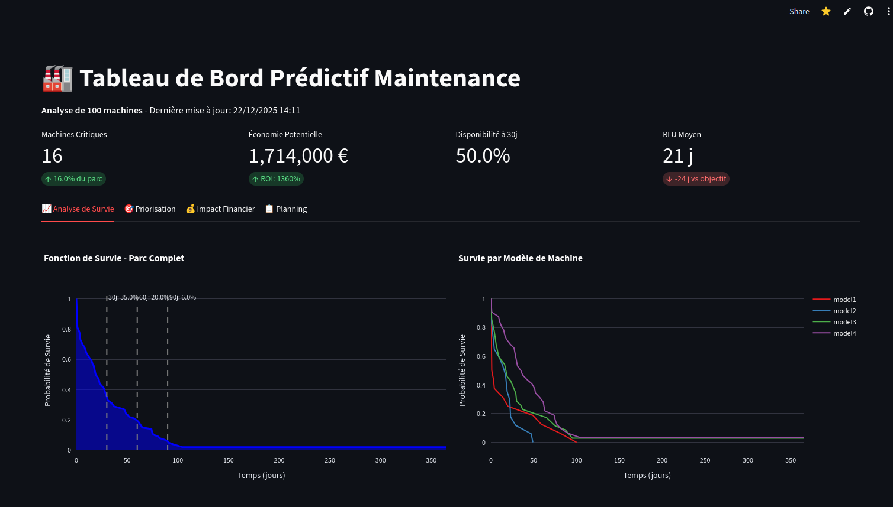
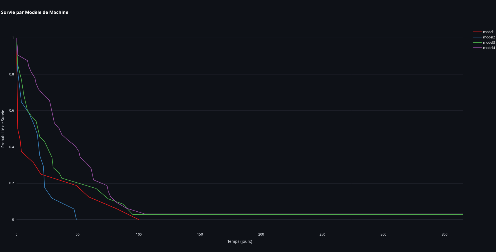
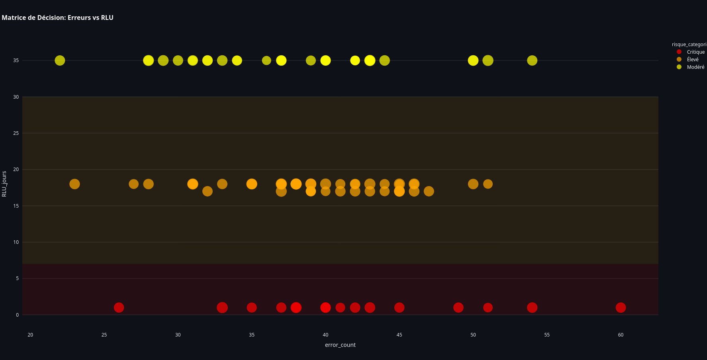

# Maintenance Prédictive Industrielle — RLU & ROI

> **Statut du projet :** 🚧 En cours de développement  
> **Objectif principal :** Passer d’une maintenance curative à une **maintenance prédictive orientée ROI**, en exploitant les données industrielles et l’IA.

---

## Contexte Industriel

Dans l’industrie, une panne non planifiée peut coûter jusqu’à **50 000 €** par incident  
(perte de production, interventions d’urgence, pénalités contractuelles).

 La **maintenance prédictive** permet d’anticiper ces pannes en estimant la  
**RLU (Remaining Useful Life)** des équipements et en **optimisant le planning de maintenance**.

Ce projet propose un **tableau de bord décisionnel interactif** combinant :
- analyse de survie
- machine learning
- indicateurs financiers (ROI)

---

##  Objectifs du Projet

- **Réduire les coûts de maintenance** liés aux pannes imprévues  
- **Anticiper les défaillances** via la prédiction du RLU  
- **Aider à la décision** grâce à un *Health Score* interprétable (0–100)  
- **Optimiser le planning de maintenance** selon la criticité réelle  
- **Mesurer l’impact financier (ROI)** de la maintenance préventive  

---

## Concepts Clés

### 🔹 RLU — Remaining Useful Life
Nombre de **jours restants avant défaillance probable** d’une machine.

> Le RLU est l’indicateur central pour décider **quand intervenir**, ni trop tôt  
> (coûts inutiles), ni trop tard (pannes critiques).

---

### 🔹 ROI — Return On Investment
Mesure la **rentabilité économique** de la maintenance prédictive :

\[
ROI = \frac{\text{Coûts évités} - \text{Coûts de maintenance}}{\text{Coûts de maintenance}}
\]

---

##  Données Utilisées

- **Source :** Microsoft Azure Predictive Maintenance Dataset (Kaggle)
- **Types de données :**
  - Télémétrie (vibration, pression, rotation, voltage)
  - Historique de maintenance
  - Compteurs d’erreurs
  - Informations machines (âge, modèle)

---

##  Méthodologie & Approche Data Science

### 1️ Feature Engineering Métier
- **Health Score (0–100)**  
  Combinaison pondérée des erreurs, maintenances et capteurs
- **Agrégation télémétrique**  
  Moyenne, écart-type et amplitude des capteurs
- **Sévérité de défaillance** (faible → critique)

---

### 2️ Analyse de Survie (Statistique)
- Estimateur de **Kaplan-Meier**
- Probabilité de survie à **30 / 60 / 90 jours**
- Comparaison par **modèle de machine**

---

### 3️ Machine Learning
- **Random Forest Regressor**
- Prédiction du **RLU en jours**
- Métriques :
  - Erreur Moyenne Absolue (MAE)
  - Score R²
- Détection et suppression des outliers

---

## 🖥️ Aperçu du Tableau de Bord

### 🔹 Indicateurs Clés (KPI)
- Nombre de machines critiques
- RLU moyen
- Disponibilité à 30 jours
- Économie potentielle & ROI



---

### 🔹 Analyse de Survie
Visualisation des courbes de survie globales et par modèle de machine.



---

### 🔹 Matrice de Risque & Priorisation
Croisement du **nombre d’erreurs** et du **RLU** pour prioriser les interventions.



---

## 📅 Planning de Maintenance Intelligent

- Calcul d’un **score de priorité**
- Recommandation d’actions :
  - 🔴 Intervention urgente
  - 🟠 Maintenance planifiée
  - 🟡 Surveillance renforcée
  - 🟢 Maintenance standard
- Génération d’un **planning Gantt**
- Estimation :
  - durée d’intervention
  - coût associé

---

## 💰 Impact Business & ROI

Le tableau de bord permet de :
- quantifier les **pannes évitées**
- estimer les **économies annuelles**
- mesurer le **ROI de la maintenance prédictive**
- justifier les décisions auprès du management

---

## 🚀 Installation & Lancement

### Prérequis
- Python 3.9+
- pandas
- numpy
- streamlit
- scikit-learn
- plotly
- lifelines

### Installation

```bash
git clone https://github.com/ton-profil/predictive-maintenance-industry.git
cd predictive-maintenance-industry
pip install -r requirements.txt
