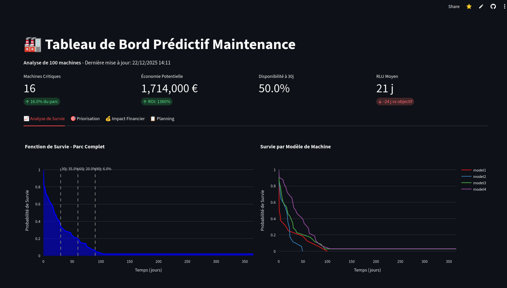
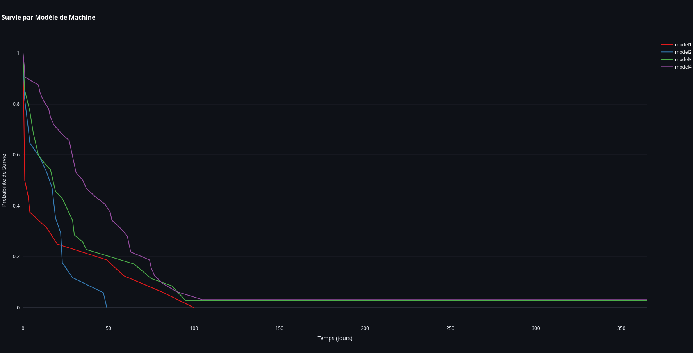
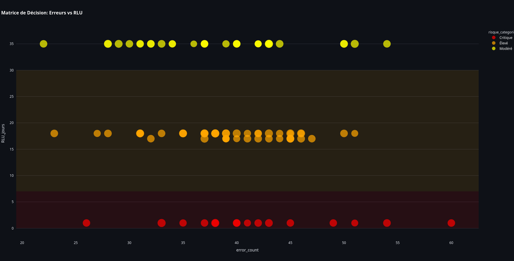

# Maintenance Prédictive Industrielle — RLU & ROI

> **Objectif :** transformer la maintenance curative en stratégie **prédictive orientée ROI**, en exploitant la télémétrie industrielle et le Machine Learning pour optimiser la disponibilité des actifs.

[](https://predictive-maintenance-in-industry-ci7wzatf9nlcghomctgbtx.streamlit.app/)

---

## Problématique business

Dans l'industrie, une panne imprévue coûte cher : arrêt de ligne, logistique d'urgence, pénalités contractuelles. Le défi est un arbitrage de timing :

- **Intervenir trop tôt** → coûts inutiles sur des pièces encore fonctionnelles.
- **Intervenir trop tard** → panne critique, arrêt de production, risque sécuritaire.

Ce dashboard transforme la télémétrie brute en deux indicateurs de décision :

1. **RLU (Remaining Life Until failure)** — durée de vie restante estimée d'un équipement.
2. **ROI** — rentabilité financière d'une intervention préventive anticipée.

---

## Objectifs du projet

- Réduire les coûts liés aux arrêts non planifiés.
- Anticiper les défaillances par l'analyse de survie et le Machine Learning.
- Fournir un *Health Score* métier (0–100) lisible par des non-data scientists.
- Prioriser les interventions selon la criticité réelle du parc.
- Chiffrer l'impact financier pour justifier l'investissement dans l'outil.

---

## Concepts clés

**RLU — Remaining Life Until failure**
Nombre de jours restants avant défaillance probable d'une machine. Estimé par la médiane de survie de l'estimateur de Kaplan-Meier, par modèle de machine ; en cas d'échantillon trop petit pour un ajustement fiable (< 5 machines), l'outil retombe sur la médiane empirique du groupe et l'indique explicitement (voir *Fiabilité & transparence* ci-dessous).

**ROI — Return On Investment**

```
ROI = (Coûts de pannes évités − Coûts de maintenance préventive) / Coûts de maintenance préventive
```

---

## Données utilisées

- **Source :** Microsoft Azure Predictive Maintenance Dataset (Kaggle).
- **Contenu :** télémétrie (vibration, pression, rotation, voltage), historique de maintenance, compteurs d'erreurs, âge et modèle de chaque machine.

---

## Méthodologie

### 1. Feature engineering métier
- **Health Score** (0–100) à partir de la fréquence d'erreurs et de maintenances.
- **Sévérité** : score de criticité (1 à 3) basé sur le volume d'erreurs, pour prioriser les interventions.
- **Agrégats télémétriques** (moyenne, écart-type, amplitude) sur les 4 capteurs.

### 2. Analyse de survie
- Estimateur de **Kaplan-Meier**, ajusté par modèle de machine.
- Probabilités de survie à **30 / 60 / 90 jours**.
- Un panneau **"Transparence statistique"** indique, pour chaque modèle, si le RLU vient de Kaplan-Meier ou d'un fallback empirique — pour ne jamais présenter une estimation comme plus fiable qu'elle ne l'est.

### 3. Machine Learning
- **Modèle :** Random Forest Regressor, prédisant le RLU en jours à partir de l'âge, des compteurs d'erreurs/maintenance, de la sévérité et de la télémétrie agrégée.
- **Évaluation :** MAE et R² calculés sur un **jeu de test isolé (25%)**, jamais sur les données d'entraînement, pour une mesure de performance honnête.
- Un simulateur interactif permet de tester un scénario machine (âge, erreurs, maintenances) et d'obtenir une recommandation d'action.

### 4. Paramétrage dynamique
Les seuils critique/alerte et les coûts de panne/maintenance sont réglables depuis la barre latérale et **recalculent en direct** l'impact financier et le planning — aucune valeur métier n'est figée en dur dans le code.

---

## Aperçu du dashboard

### Indicateurs clés (KPI) & ROI

> Pilotage financier direct : le ROI valide la valeur générée par l'outil, la disponibilité à 30 jours aide à la planification de production.

### Analyse de survie

> Identifie les modèles de machines statistiquement les plus fragiles, pour adapter les contrats de maintenance par segment de parc.

### Matrice de risque & priorisation

> Croisement Health Score × RLU : les machines en zone rouge sont signalées pour une intervention immédiate.

---

## Planning de maintenance intelligent

Le dashboard génère automatiquement :
- une recommandation d'action (🔴 Urgent · 🟠 Planifié · 🟡 Surveillance · 🟢 Standard) ;
- un planning Gantt prévisionnel sur 30 jours ;
- une estimation de durée et de coût par intervention, filtrable par modèle, niveau de risque et RLU.

---

## Fiabilité & transparence

Points d'ingénierie volontairement mis en avant plutôt que masqués :
- Les valeurs par défaut ne sont jamais un résultat silencieux : quand une estimation Kaplan-Meier échoue, l'application le signale au lieu d'afficher un chiffre invérifiable comme s'il était fiable.
- Le modèle Random Forest et son scaler sont entraînés une fois (mis en cache) et évalués sur un jeu de test dédié ; les prédictions sont ensuite appliquées sans jamais ré-entraîner ni muter les données mises en cache.
- Toutes les erreurs de chargement (fichier absent, colonnes manquantes) sont explicites côté interface, pas des exceptions silencieuses.

---

## Installation & lancement

### Prérequis
Python 3.9+, `streamlit`, `pandas`, `numpy`, `scikit-learn`, `plotly`, `lifelines`.

### Lancement local
```bash
git clone https://github.com/Dave-kossi/predictive-maintenance-industry.git
cd predictive-maintenance-industry

pip install -r requirements.txt

streamlit run app.py
```

Le fichier de données `Predictive_Table.csv` doit être présent à la racine du projet (mêmes colonnes que le Microsoft Azure Predictive Maintenance Dataset : `machineID`, `model`, `age`, `time`, `event`, `error_count`, `maint_count`, `volt`, `rotate`, `pressure`, `vibration`).

---

## Stack technique

`Python` · `Streamlit` · `pandas` / `numpy` · `scikit-learn` (Random Forest) · `lifelines` (Kaplan-Meier) · `Plotly`

---

## Auteur

**Kossi Noumagno** — Master 2 Ingénierie Mathématique & Data Science, Université de Haute-Alsace.
[LinkedIn](https://linkedin.com/in/kossi-noumagno) · [GitHub](https://github.com/Dave-kossi) · [Portfolio](https://dave-kossi.github.io/kossi-NOUMAGNO)
